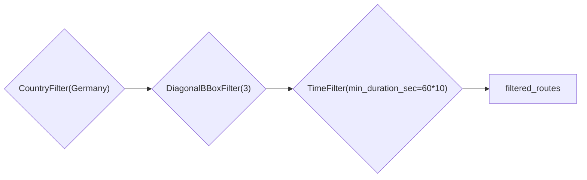

# watchlib

> **DISCLAIMER**: 
> This package is deprecated.

As I am a long-term user of Apple Watches since 2018, I always enjoyed looking at various stats in Apples Health and Fitness apps.
However sometimes I wanted more than that, which is why I am working on the Python module [watchlib](https://www.github.com/marcjulianschwarz/watchlib). It enables easy and quick loading, visualizing, animating and analyzing of Apple Watch health data.

### Data loading and filtering

[watchlib](https://www.github.com/marcjulianschwarz/watchlib) features a _DataLoader_ class to load the data from the health export files and brings it into usable formats. Using the _CacheHandler_ you can export the formatted data for faster access when running the application again.

With a pipeline based filtering system, you can easily filter filter the data to your likings.

Right now there are three different filters for WorkoutRoutes:

- _DiagonalBBoxFilter_: filter routes based on their diagonal distance if you imagine a box surrounding the route
- _CountryFilter_: filter routes based on the country they were recorded in
- _TimeFilter_: filter routes based on their duration and/or on their recording time

Using the _FilterPipeline_ you can create a sequence of filters. In the following example only routes which have been recorded in Germany, with a diagonal distance of 3km and with a minimum duration time of 10 minutes are left.

```
cf = CountryFilter(Germany)
df = DiagonalBBoxFilter(3)
tf = TimeFilter(min_duration_sec=60*10)

p = FilterPipeline(cf, df, tf)
filtered_routes = p.filter(routes)
```


### Animations

[watchlib](https://www.github.com/marcjulianschwarz/watchlib) can animate a `WorkoutRoute` and `ECG` using `WorkoutAnimation` and `ECGAnimation`.
Here are some examples:


The animation can of course be customized. Changing the _color_on_ parameter to one of these values:

- _elevation_
- _speed_
- _course_
- _hAcc_
- _vAcc_

will color the route accordingly.

### ECG Analysis

With [watchlibs](https://www.github.com/marcjulianschwarz/watchlib) ecg_analysis submodule you can quickly analyze a 30sec ECG. It can calculate the average heartbeats per minute by counting spikes in the electrocardiogram.

By calculating the time between every heartbeat an estimation of the heartbeat variability (HRV) can be obtained from an ECG too. While this value is not at all representative of the actual HRV (because the recordings are way too short) it is still cool to see that splitting an ECG at every heartbeat and layering all these actions on top of each other reveals the variability between the heartbeats:


### Demonstrator

To showcase the watchlib demonstrator I made a short video:



